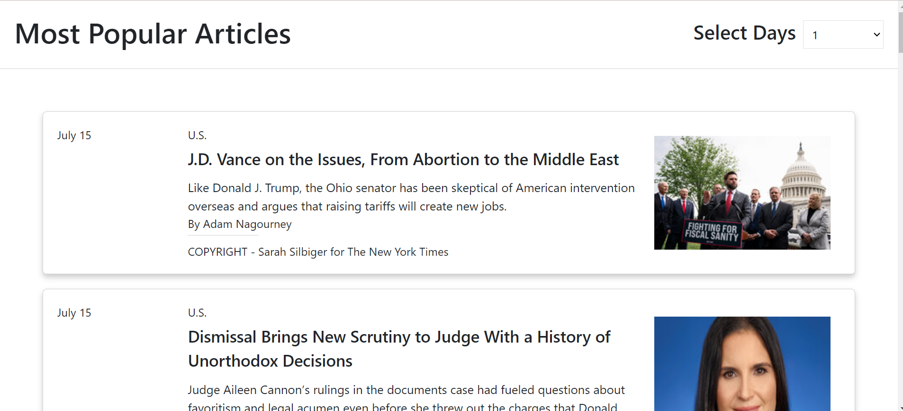
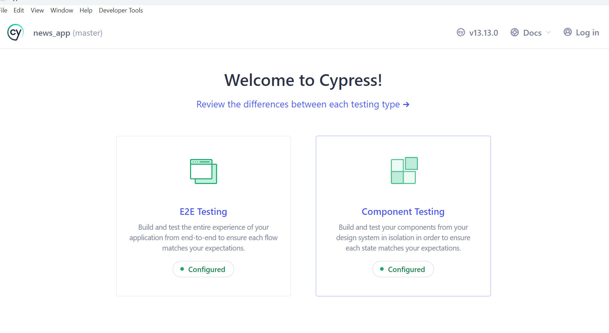
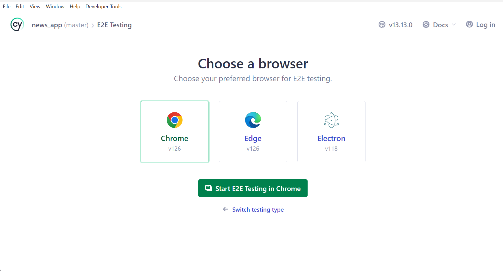

## About the App 

This is a simple app whichs show the list of Most Popular NY Articles and on click of
article it will take you to Detail page of the article.

### `Home Page`

### `Detail Page`

## Technical Stack

ReactJs

TypeScript

Redux-Saga

JEST

TestingLibrary/react

Cypress

## Available Scripts

In the project directory, you can run:

### `yarn install`

To install all the project related packages from package.json. It will create a yarn.lock 
file in you project 

### `yarn start`

Runs the app in the development mode.\
Open [http://localhost:3000](http://localhost:3000) to view it in your browser.

The page will reload when you make changes.
You may also see any lint errors in the console.

### `yarn test`

Launches the test runner in the interactive watch mode.
You can find the coverage report in coverage package coverage/icov-report/index.html

### `yarn build`
 
Builds the app for production to the `build` folder.\
It correctly bundles React in production mode and optimizes the build for the best performance.

The build is minified and the filenames include the hashes.\
Your app is ready to be deployed!

## For Windows

In package.json for building the project use

###  "start": "SET NODE_OPTIONS=--openssl-legacy-provider && react-scripts start",
###  "build": "SET NODE_OPTIONS=--openssl-legacy-provider && react-scripts build",

## For Mac

In package.json for building the project use

###  "start": "react-scripts start",
###  "build": "react-scripts build",

## Version Used

### yarn - 1.22.22
### node - 22.3.0
### npm - 10.8.1

## Cypress E2E testing

### yarn add cypress  

Above command will add cypress into your code

### yarn run cypress open 

It will open cypress window and cofigure some steps to add it into you code 
After writing cypress test cases. In that window it will execute the test cases.

